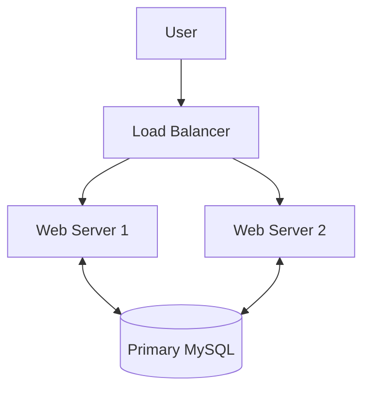

---
type:
  - lecture
  - study_session
topics covered: quiz
created_on: 18-05-26 @ 18:44
tags:
source:
related:
author:
description:
aliases:
status: open
image: 18-05-26.svg
---
# 18-05-26 study_sess
```simple-time-tracker
{"entries":[{"name":"PF short notes","startTime":"2026-05-18T13:46:44.000Z","endTime":"2026-05-19T13:41:47.039Z"}]}
```
# PF Short notes
# Lecture
ICT quiz fucked up 
Precalc quiz fucked up 



^mermaid-18-05-26-1
